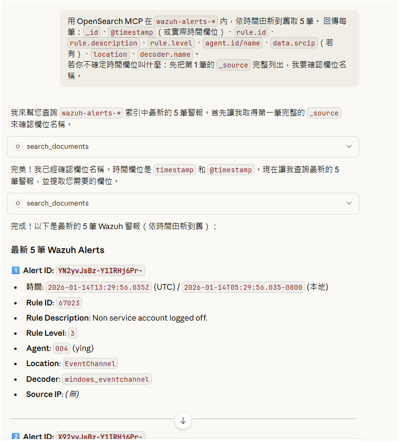
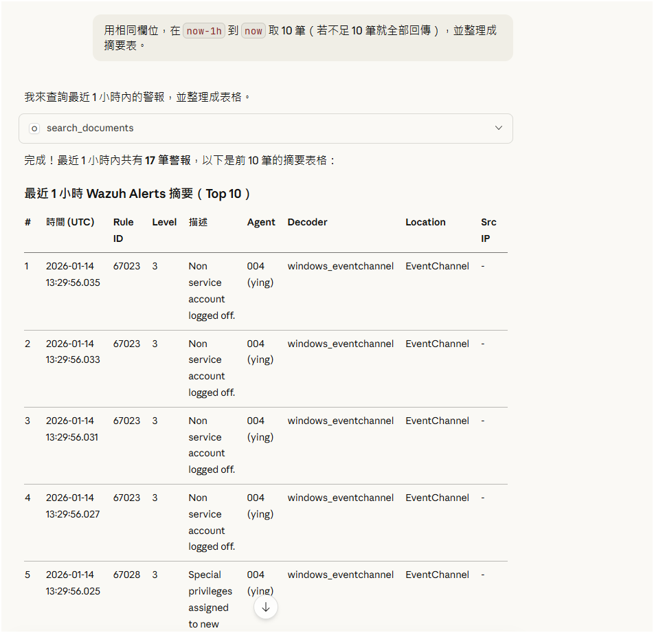
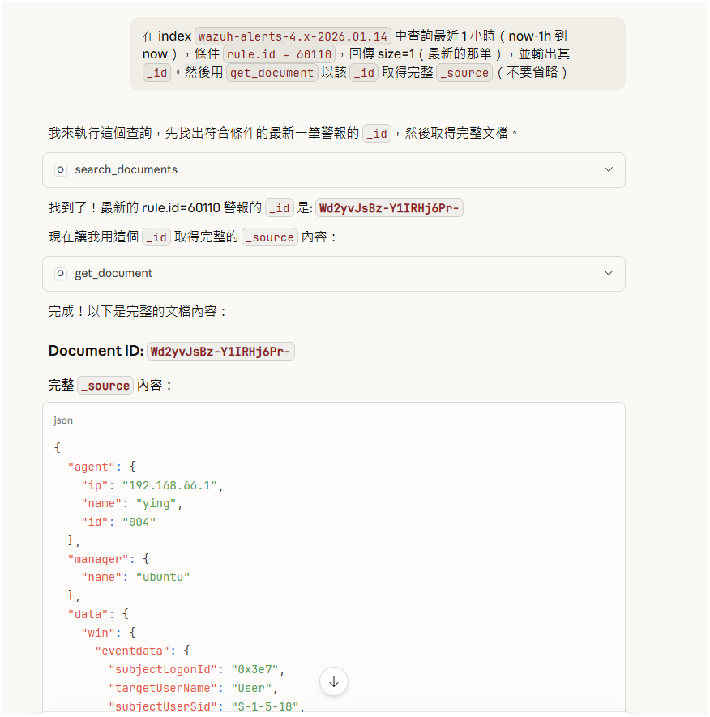
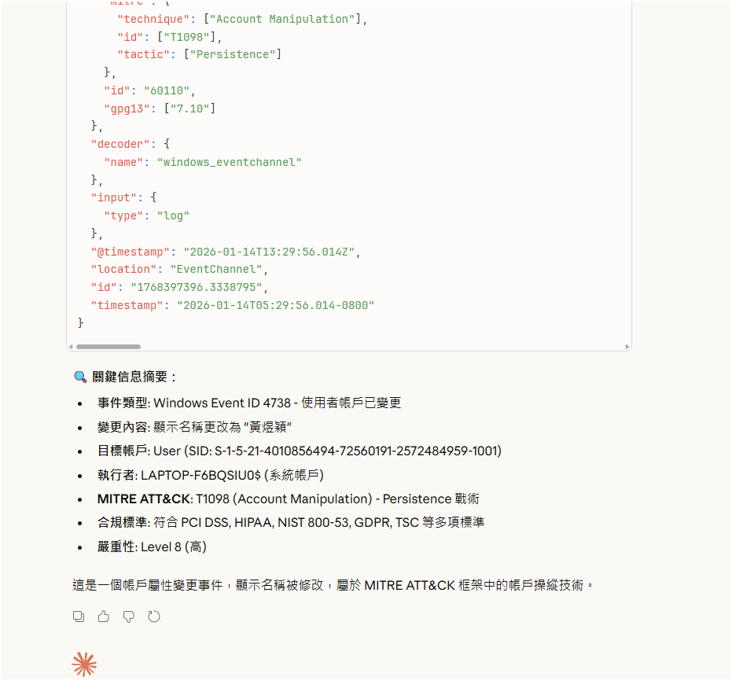
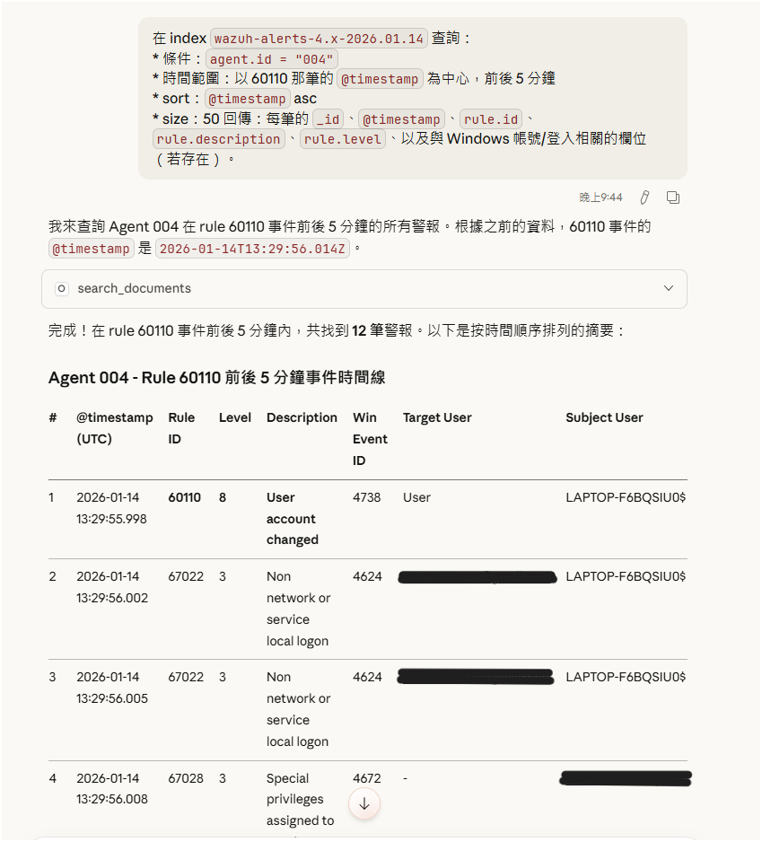
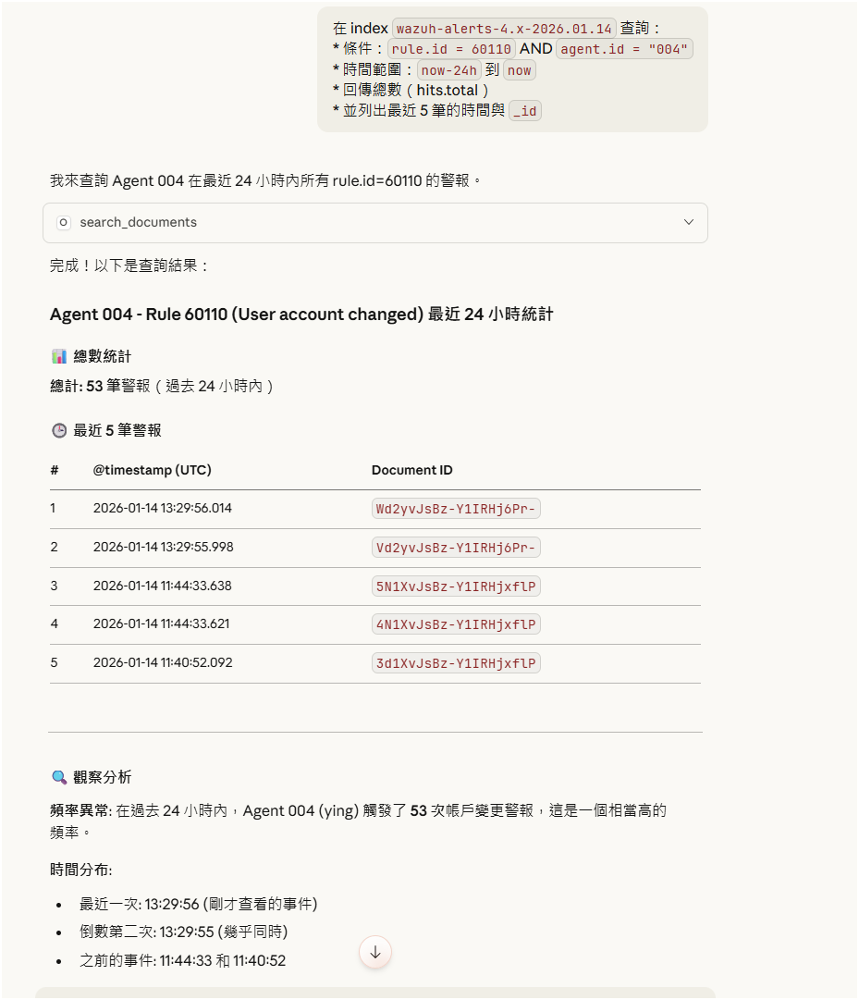

# wazuh-mcp-opensearch-lab
威脅列補期末作業-MCP SERVER
# Wazuh MCP × OpenSearch MCP：告警查詢與事件時間線（實作紀錄）

## 一、目的
本專案紀錄我在本機使用 Claude Desktop 的 MCP（Model Context Protocol）工具鏈，
串接 **Wazuh API** 與 **OpenSearch**，完成「近 1 小時告警摘要」與「特定規則事件追蹤」等查詢，
並整理為可重複使用的 Query JSON 範例，作為後續威脅獵捕與事件分析的基礎。

---

## 二、使用技術與環境
- **Claude Desktop**：MCP 工具呼叫與互動操作
- **Wazuh MCP Server**：查詢 Wazuh Manager/Agents/Health 等資訊
- **OpenSearch MCP Server**：查詢 Wazuh Alerts 索引（wazuh-alerts-*）
- **OpenSearch Query DSL**：以時間區間（now-1h ~ now）、rule.id、agent.id 等條件做搜尋與排序
- 作業系統：Windows（Client）+ Wazuh Server（Ubuntu / VM）

---

## 三、實作成果（重點）
1. ✅ 確認 Wazuh API 連線正常（health/summary 可回應）
2. ✅ 取得 agents 清單（至少包含 manager 本機與 Windows agent）
3. ✅ 於 OpenSearch 列出 alerts 索引並確認最新索引（例：wazuh-alerts-4.x-YYYY.MM.DD）|  |  |
4. ✅ 查詢最近 1 小時告警 Top 10，整理欄位（時間、rule、level、agent、decoder、location 等）
5. ✅ 針對特定規則（例：rule.id=60110）取得最新事件：
   - 先查 _id（size=1 / sort desc）
   - 再用 get_document 取得完整 _source
6. ✅ 以特定事件時間為中心，建立前後 5 分鐘事件時間線（timeline）
7. ✅ 統計最近 24 小時 rule.id=60110 在指定 agent 的觸發次數與最近事件列表

---

## 四、資料夾結構
- `screenshots/`：操作與結果截圖（證據）
- `queries/`：可重複使用的 OpenSearch Query JSON 範例

---

## 五、未來可延伸方向（發展性）
- 將查詢流程自動化：定期產生「近 1 小時告警摘要報告」
- 把 timeline 分析做成模板：遇到高風險 rule 立即拉出事件前後關聯
- 與 MITRE ATT&CK（Enterprise/ICS）對應：將 rule/事件映射到 tactic/technique
- 與後續 AI 模型整合：將事件序列餵給 LSTM/Transformer 或 Agentic RAG，做攻擊鏈推論與解釋

---
